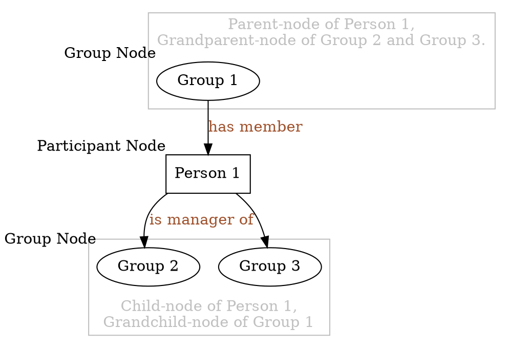

# Group Module Leadership Hierarchy

This document explains how the leadership hierarchy in Group Module works.

# Concept

The main purpose of the leadership hierarchy is to support an arbitrary number
of levels of leadership.

In a nutshell, some existing group leaders can be grouped together in a new
group, and leaders of that new group will have privilege over both the new
group and groups under it.

# Terminology

By _Participant_, we mean either a _Group Member_ or a _Group Manager_ in the
Group Module

A _Node_, or _HierarchyNode_, is an abstract entity representing either a
_Participant_ or a _Group_. Every _Node_ has the following characteristics:

-   super-nodes
    -   For a _Group_, its super-nodes are its _Group Manager_ s.
    -   For a _Participant_, its super-nodes are _Group_ s where the
        participant is a _Group Manager_.
-   sub-nodes
    -   For a _Group_, its sub-nodes are its _Member_ s.
    -   For a _Participant_, its sub-nodes are _Group_ s where the
        participant is a _Member_.

In this document, both _super-node_ and _sub-node_ will often be preceded with
a modifier _immediate_ or _all_.

_Immediate_ super/sub-nodes have the same meaning as super/sub-nodes used
without the modifier, according to the above definition. Their synonyms also
include _parent-node_ and _child-node_.

By _all_ super/sub-nodes, we also include the nodes that are the
_super/sub-node_ s of the current _Node_ 's _super/sub-node_ s, and the
_super/sub-node_ s of those, etc.

A user `u` is a _Group Overseer_ of group `g` if and only if `g` is among `u`'s
_all sub-nodes_.  

A node `gp` is a _grandparent-node_ of `n`, if `gp` is the immediate super-node
of some `pn`, where `pn` is an immediate super-node of `n`.

The diagram below illustrates some of the key terminologies.

![Terminology-illustration](https://g.gravizo.com/svg?digraph%20G%20%0A%7B%20%0A%20%20%20%20edge%20%5Bfontcolor%3Dsienna%5D%3B%0A%20%20%20%20subgraph%20cluster_1%20%7B%20%0A%20%20%20%20%20%20%20%20G1%3B%0A%20%20%20%20%20%20%20%20fontcolor%3Dgrey%3B%0A%20%20%20%20%20%20%20%20color%3Dgrey%3B%0A%20%20%20%20%20%20%20%20label%3D%22Parent-node%20of%20Person%201%2C%5CnGrandparent-node%20of%20Group%202%20and%20Group%203.%22%3B%0A%20%20%20%20%7D%0A%20%20%20%20subgraph%20cluster_0%20%7B%20%0A%20%20%20%20%20%20%20%20G2%3B%0A%20%20%20%20%20%20%20%20G3%3B%0A%20%20%20%20%20%20%20%20fontcolor%3Dgrey%3B%0A%20%20%20%20%20%20%20%20color%3Dgrey%3B%0A%20%20%20%20%20%20%20%20label%3D%22Child-node%20of%20Person%201%2C%5CnGrandchild-node%20of%20Group%201%22%3B%0A%20%20%20%20%20%20%20%20labelloc%3Db%3B%0A%20%20%20%20%7D%20%0A%20%20%20%20G1%20-%3E%20P1%20%5Blabel%3D%22has%20member%22%5D%3B%0A%20%20%20%20P1%20-%3E%20G2%20%5Blabel%3D%22is%20manager%20of%22%5D%3B%0A%20%20%20%20P1%20-%3E%20G3%3B%0A%20%20%20%20G1%20%5Blabel%3D%22Group%201%22%3B%20xlabel%3D%22Group%20Node%22%5D%3B%0A%20%20%20%20G2%20%5Blabel%3D%22Group%202%22%3B%20xlabel%3D%22Group%20Node%22%5D%3B%0A%20%20%20%20G3%20%5Blabel%3D%22Group%203%22%5D%3B%0A%20%20%20%20P1%20%5Bshape%3Drectangle%3B%0A%20%20%20%20label%3D%22Person%201%22%3B%0A%20%20%20%20xlabel%3D%22Participant%20Node%22%5D%3B%0A%7D%0A)

 A note on the diagram 

Digrams in this document are drawn using the `dot` notation with the aid of an
online service `Gravizo` that renders graphs dynamically. 

Each graph url looks like `https://g.gravizo.com/svg?digraph%20...`.

To edit the graph, copy the characters after the `?`, and urldecode it. To do
this, you can use python's `urllib.parse.unquote` function. Then you should
have a readable `dot` graph, like the following:

See [here](https://renenyffenegger.ch/notes/tools/Graphviz/examples/index) for
some sample graphs and their corresponding code.  

After editing, perform the reverse process (you can use python's `urllib.parse.unquote` to do this) and append the graph after the `?` in the url. The graph should be rendered properly.

# Features

## Permission Control (not implemented)

The leadership hierarchy is used to grant more granular permission to different
users based on their belonging groups.

Unlike the _Group Admin_ role, which acts on all groups, the leadership
hierarchy system identifies the _Group Overseer_ s for _every group_.

Permissions to perform various operations (e.g. remove a group member, take
attendance, etc.) are granted based on the _Group Overseer_ role of the user.

> Security note: For now, the group hierarchy algorithm is implemented using
> Typescript/Javascript, and the backend would not have access to the leadership
> hierarchy information. As a result, someone could theoretically make direct
> request to the API to bypass this privilege checking.

> It would be best to find a way to use the algorithm on both the front-end and
> the back-end, without implementing it twice

## Cycle Prevention

Currently, the `GroupParticipants` component checks and prevents the user from
performing the following actions if the action introduces a cycle in the
leadership hierarchy:

-   adding a participant
-   moving a participant to another group
-   reactivating an archived participant
-   reactivating an archived group (not implemented)

## Hierarchy Treeview

The hierarchy treeview is implemented in `GroupTreeViewHierarchy` component.

### Admin User 

When the admin user navigates to that page, a tree will be rendered.  Since it
is possible for two groups to be _detached_, several _root node_ s are
identified before the tree is drawn.

A _root node_ `r` is a node that either:

1.  does not have any super-node, or
1.  each of its immediate super-nodes `s` satisfies the constraint that `r` is
    the only super-node of `s`.

    In other words, all of `r`'s grandparent-node (if any) is itself.

After the _root node_ s are identified, the component starts building a tree
from each of those _root node_ s, based on their sub-nodes. Repeated nodes are
shown but not expanded.

### Group Leader

Not implemented

# Edge Cases

## Manager-member double identity

Since it is common for a group manager to also be a member of the same group,
the hierarchy system permits the following linkage to be made, where "Person 1"
is both a manager and a member of "Group 1." 

Thus, the following situations are allowed.

### Allowed Case: double identity
 

##### logical equivalences

### Allowed Case: multiple people with double identity

##### logical equivalence

> For this case, the rendered tree will be similar to the illustration below,
> Note that "Group 2" is a _root node_ being appended under the "Admin" node,
> and the lower-level "Group 2" are no longer expanded

> 

### Disallowed Case: Repeated node through different nodes

##### logical equivalence

Note there is no _root node_ in this diagram, so there is no way for the treeview
component to pick up any of the nodes and start building the tree.
