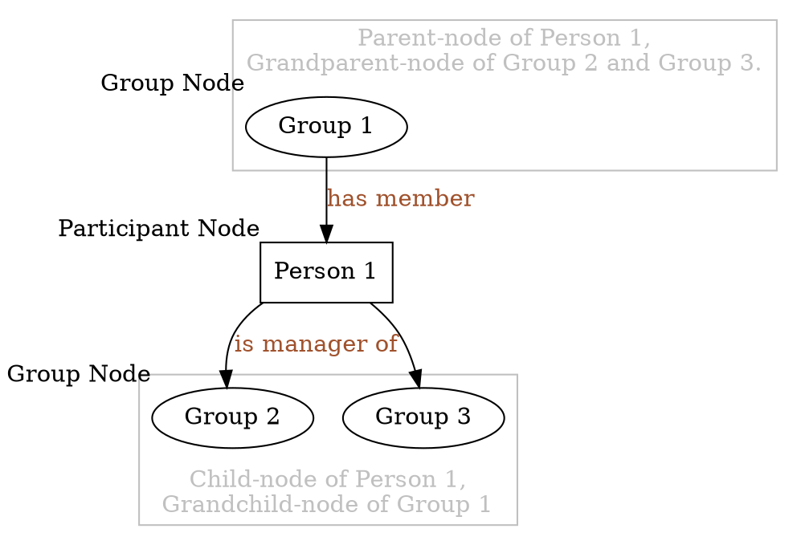
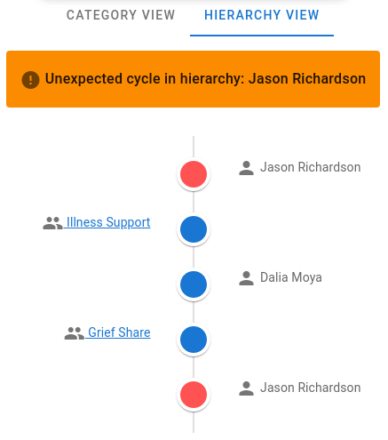

# Group Module Leadership Hierarchy

This document explains how the leadership hierarchy in Group Module works.

# Concept

The main purpose of the leadership hierarchy is to support an arbitrary number
of levels of leadership.

In a nutshell, some existing group leaders can be grouped together in a new
group, and leaders of that new group will have privilege over both the new
group and groups under it.

# Terminology

By _Participant_, we mean either a _Group Member_ or a _Group Manager_ in the
Group Module

A _Node_, or _HierarchyNode_, is an abstract entity representing either a
_Participant_ or a _Group_. Every _Node_ has the following characteristics:

-   super-nodes
    -   For a _Group_, its super-nodes are its _Group Manager_ s.
    -   For a _Participant_, its super-nodes are _Group_ s where the
        participant is a _Group Manager_.
-   sub-nodes
    -   For a _Group_, its sub-nodes are its _Member_ s.
    -   For a _Participant_, its sub-nodes are _Group_ s where the
        participant is a _Member_.

In this document, both _super-node_ and _sub-node_ will often be preceded with
a modifier _immediate_ or _all_.

_Immediate_ super/sub-nodes have the same meaning as super/sub-nodes used
without the modifier, according to the above definition. Their synonyms also
include _parent-node_ and _child-node_.

By _all_ super/sub-nodes, we also include the nodes that are the
_super/sub-node_ s of the current _Node_ 's _super/sub-node_ s, and the
_super/sub-node_ s of those, etc.

A user `u` is a _Group Overseer_ of group `g` if and only if `g` is among `u`'s
_all sub-nodes_.

A node `gp` is a _grandparent-node_ of `n`, if `gp` is the immediate super-node
of some `pn`, where `pn` is an immediate super-node of `n`.

The _relative nodes_ of a node is the union of its _all sub-nodes_ and _all
super-nodes_.

Two nodes are _detached_ if and only if they don't have any common _relative
nodes_, including themselves.

A _path_ is a sequence of nodes, where each preceding node is an _immediate
super-node_ of the node following it. The _length_ of a path is the number of
nodes contained in the path.

A _cycle_ in the leadership hierarchy occurs when a node becomes a _sub-node_
or a _super-node_ of itself __through a _path_ (excluding itself on both ends)
of non-repeated nodes with a _length_ of 3 or above__. For more clarification
on the bolded part, see the [edge case section](#edge-cases).

The diagram below illustrates some of the key terminologies.

![Terminology-illustration](https://g.gravizo.com/svg?digraph%20G%20%0A%7B%20%0A%20%20%20%20edge%20%5Bfontcolor%3Dsienna%5D%3B%0A%20%20%20%20subgraph%20cluster_1%20%7B%20%0A%20%20%20%20%20%20%20%20G1%3B%0A%20%20%20%20%20%20%20%20fontcolor%3Dgrey%3B%0A%20%20%20%20%20%20%20%20color%3Dgrey%3B%0A%20%20%20%20%20%20%20%20label%3D%22Parent-node%20of%20Person%201%2C%5CnGrandparent-node%20of%20Group%202%20and%20Group%203.%22%3B%0A%20%20%20%20%7D%0A%20%20%20%20subgraph%20cluster_0%20%7B%20%0A%20%20%20%20%20%20%20%20G2%3B%0A%20%20%20%20%20%20%20%20G3%3B%0A%20%20%20%20%20%20%20%20fontcolor%3Dgrey%3B%0A%20%20%20%20%20%20%20%20color%3Dgrey%3B%0A%20%20%20%20%20%20%20%20label%3D%22Child-node%20of%20Person%201%2C%5CnGrandchild-node%20of%20Group%201%22%3B%0A%20%20%20%20%20%20%20%20labelloc%3Db%3B%0A%20%20%20%20%7D%20%0A%20%20%20%20G1%20-%3E%20P1%20%5Blabel%3D%22has%20member%22%5D%3B%0A%20%20%20%20P1%20-%3E%20G2%20%5Blabel%3D%22is%20manager%20of%22%5D%3B%0A%20%20%20%20P1%20-%3E%20G3%3B%0A%20%20%20%20G1%20%5Blabel%3D%22Group%201%22%3B%20xlabel%3D%22Group%20Node%22%5D%3B%0A%20%20%20%20G2%20%5Blabel%3D%22Group%202%22%3B%20xlabel%3D%22Group%20Node%22%5D%3B%0A%20%20%20%20G3%20%5Blabel%3D%22Group%203%22%5D%3B%0A%20%20%20%20P1%20%5Bshape%3Drectangle%3B%0A%20%20%20%20label%3D%22Person%201%22%3B%0A%20%20%20%20xlabel%3D%22Participant%20Node%22%5D%3B%0A%7D%0A)

<details>

<summary> A note on the diagram </summary>

## Diagrams

Digrams in this document are drawn using the `dot` language with the aid of an
online service `Gravizo` that renders graphs dynamically.

Each graph url looks like `https://g.gravizo.com/svg?digraph%20...`.

To edit the graph, copy the characters after the `?`, and urldecode it. To do
this, you can use python's `urllib.parse.unquote` function. Then you should
have a readable `dot` graph, like the following:



See [here](https://renenyffenegger.ch/notes/tools/Graphviz/examples/index) for
some sample graphs and their corresponding code.

After editing, perform the reverse process (you can use python's
`urllib.parse.quote` to do this) and append the graph after the `?` in the url.
The graph should be rendered properly.

</details>

# Features

## Permission Control

The leadership hierarchy is used to grant more granular permission to different
users based on their belonging groups.

Unlike the _Group Admin_ role, which acts on all groups, the leadership
hierarchy system identifies the _Group Overseer_ s for _every group_.

Permissions to perform various operations (e.g. remove a group member, take
attendance, etc.) are granted based on the _Group Overseer_ role of the user.

Some of the permission differences are highlighted in the table below:

| Page\Role             | Group Admin                       | Group Overseer                        | Normal User          |
| --------------------- | --------------------------------- | ------------------------------------- | -------------------- |
| Category Treeview     | Send email to all existing groups | Send email to overseeing groups       | Unavailable          |
| Manager Tab           | CRUD operations on managers       | View active managers                  | View active managers |
| Member Tab            | CRUD operations on members        | CRUD operations on members            | View active members  |
| Attendance Line Graph | View attendance of all groups     | View attendance of overseeing groups  | Unavailable          |

## Cycle Prevention

Currently, the following components check and prevent the user from performing
certain actions if the action introduces a cycle in the leadership hierarchy:

### `GroupParticipants`

-   adding a participant
-   moving a participant to another group
-   reactivating an archived participant

### `GroupTable`

-   reactivating an archived group

## Hierarchy Treeview

The hierarchy treeview is implemented in `GroupTreeViewHierarchy` component.
This component seeks to provide a visualization of the current leadership
hierarchy.

### Admin User

When the admin user navigates to the page, a tree containing information of all
existing active `Group`s will be rendered. Since it is possible for two groups
to be _detached_, several _root node_ s are identified before the tree is
drawn.

A _root node_ is a node that either:

1.  does not have any super-node, or
1.  its every `immediate super-node` is also its `immediate sub-node`.

After the _root node_ s are identified, the component starts building a tree
from each of those _root node_ s, based on their sub-nodes. Repeated nodes due
to [double identity](#manager-member-double-identity) are ommitted. 

### Group Overseer

If a user without the _Group Admin_ role navigates to the treeview page, a tree
will be drawn from the current user by searching its _all sub-nodes_.

### Normal User

For a normal user who is not an overseer of any group, a note will be displayed
upon navigating to the treeview page, indicating that the user is not an
overseer of any existing groups.

## Cycle Handling

Although the system tries to prevent the user from creating cycles, there is
nevertheless a possibility for cycles to exist in hierarchy structure, either
through direct insertions into the database, or through some unhandled edge
cases. The system implements the following mechanisms to handle unexpected
cycles.

### Error Notification 

Unexpected cycles will trigger an error message to the user upon detection.

### Cycle Display

When the user navigates to the `GroupTreeViewHierarchy` page, a path containing
the cycle will be displayed instead of the normal hierarchy treeview, giving
the user more information about the cycle that is present in the current
hierarchy, and prompting the user to resolve the cycle.



In the above example, there is a cycle involving user "Jason Richardson,"
because it becomes its own _super-node_ through the _path_ containing 3
non-repeated nodes "Illness Support," "Dalia Moya," and "Grief Share."

The administrator can, for example, remove "Jason Richardson" from the members
of group "Grief Share," to resolve the cycle.

Note, however, that the Cycle Display will only be rendered when the cycle is
linked to at least one _root node_. Due to implementation, when non of the
nodes in the cycle is, or is connected to a _root node_ (see [this
case](#disallowed-case-1:-repeated-node-through-different-nodes), for example),
the rendered hierarchy tree will render a tree normally, silently ignoring
those nodes, without displaying the cycling path.

# Edge Cases

## Manager-member double identity

Since it is common for a group manager to also be a member of the same group,
the hierarchy system permits the following linkage to be made, where "Person 1"
is both a manager and a member of "Group 1." The following examples illustrate
this idea.

### Allowed Case 1: double identity


#### Logical Equivalences


#### Rendered tree


### Allowed Case 2: multiple people with double identity


#### Rendered tree


Note that all of the nodes are considered _root node_ s in this case, being
appended under the "Admin" node.

### Disallowed Case 1: Repeated node through different nodes


#### Logical Equivalence


Note there is no _root node_ in this diagram, so there is no way for the
treeview component to pick up any of the nodes and start building the tree.

# Simulation and Test Data Generation

One may wish to have some test data generated on the server side to experiment
with the UI behavior.

Some pre-defined test data can be generated with the `flask groups` command.

Below are all available test data sets with an illustration of their
corresponding hierarchy treeview.

## Test Cases

### Test Case 1

#### Command

```bash
flask groups hierarchy-test-1
```

#### Hierarchy structure illustration

![hierarchy-test-case-1](https://g.gravizo.com/svg?digraph%20G%20%7B%0A%20%20%20%20G1%20%5Blabel%3D%22Group%201%22%5D%0A%20%20%20%20G2%20%5Blabel%3D%22Group%202%22%5D%0A%20%20%20%20G3%20%5Blabel%3D%22Group%203%22%5D%0A%20%20%20%20G4%20%5Blabel%3D%22Group%204%22%5D%0A%20%20%20%20G9%20%5Blabel%3D%22Group%209%22%5D%0A%20%20%20%20node%20%5Bshape%3Drectangle%5D%0A%20%20%20%20P3%20%5Blabel%3D%22Person%203%22%5D%0A%20%20%20%20P4%20%5Blabel%3D%22Person%204%22%5D%0A%20%20%20%20P5%20%5Blabel%3D%22Person%205%22%5D%0A%20%20%20%20P6%20%5Blabel%3D%22Person%206%22%5D%0A%20%20%20%20P8%20%5Blabel%3D%22Person%208%22%5D%0A%20%20%20%20P9%20%5Blabel%3D%22Person%209%22%5D%0A%20%20%20%20Admin%20%5Bshape%3Ddiamond%2C%20label%3DAdmin%5D%3B%0A%20%20%20%20node%20%5Bcolor%3Dred%2C%20label%3D%22Person%201%22%5D%0A%20%20%20%20P1a%20P1b%0A%20%20%20%20node%20%5Bcolor%3Dblue%2C%20label%3D%22Person%202%22%5D%0A%20%20%20%20P2a%20P2b%20P2c%0A%20%20%20%20Admin%20-%3E%20P1a%20%0A%20%20%20%20P1a%20-%3E%20G1%0A%20%20%20%20G1%20-%3E%20P1b%0A%20%20%20%20G1%20-%3E%20P3%0A%20%20%20%20G1%20-%3E%20P4%0A%20%20%20%20P1a%20-%3E%20G2%0A%20%20%20%20G2%20-%3E%20P2a%0A%20%20%20%20G2%20-%3E%20P5%0A%20%20%20%20P1a%20-%3E%20G3%0A%20%20%20%20G3%20-%3E%20P6%20-%3E%20G4%20-%3E%20P2b%0A%20%20%20%20G3%20-%3E%20P2c%0A%20%20%20%20Admin%20-%3E%20P8%20-%3E%20G9%20-%3E%20P9%3B%0A%7D%0A)

> The above diagram is slightly modified from what would be rendered at the
> treeview page for simplicity purpose. 

> For example, groups without any members or managers are ommitted from the
> diagram, although in the actual treeview, they will be considered _root node_
> s and thus being rendered. 

> Another example is that: "Group 1" would technically be considered a _root
> node_. So in the actual treeview, "Group 1" would also be attached directly
> under the "Admin" node, with all its _sub-nodes_ attached under itself. And
> the current "Person 1" under "Group 1" would be ommitted in the actual
> treeview.

> These are modified so that the hierarchy information is conveyed more
> concisely in a single diagram.

### Test Case 2

#### Command

```bash
flask groups hierarchy-test-2
```

#### Hierarchy structure illustration


> This example contains an invalid leadership hierarchy, because there is a
> _cycle_. Navigating to the treeview page should result in a warning
> message showing the cycle instead of the actual treeview.

## Notes

For testing purposes, all of the `Person`s generated using the above commands
have a first name consistent with their `id`. For example, a `Person` with `id`
1 will have a first name "Person1." The same thing applies to `Group`s. A
`Group` named "Group8" will have an `id` of 8.

Furthermore, each `Person` will have username and a password that is the same
as their first name. For example, to login as the `Person` with `id` 1, use
"Person1" as both the `username` and the `password`. This can be helpful in
testing permission enforcement feature for group-overseers.

More test cases can be added by defining more test-case-generation functions in
`corpus-christi/api/src/groups/create_group_data.py`.
